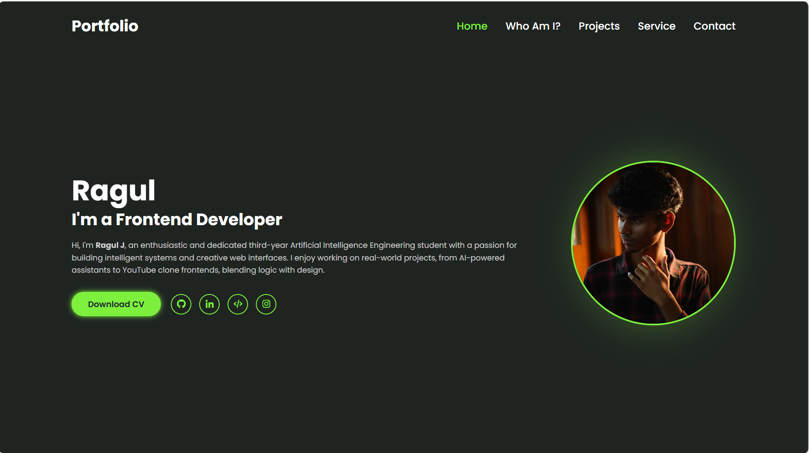

A visually appealing and responsive portfolio website to showcase my projects, skills, and contact details.

## 🌟 Features
- Animated sections with Framer Motion
- 3D elements using Three.js
- Project showcase with GitHub links
- Contact form with email integration

## 🛠️ Tech Stack
- HTML
- CSS
- JavaScript
- Three.js
- GSAP / Framer Motion

## 🔗 Live Demo

## 🧪 How to Run Locally
1. Clone this repository
2. Open `index.html` in browser

## 📸 Screenshots
> 

## 📄 License
MIT
